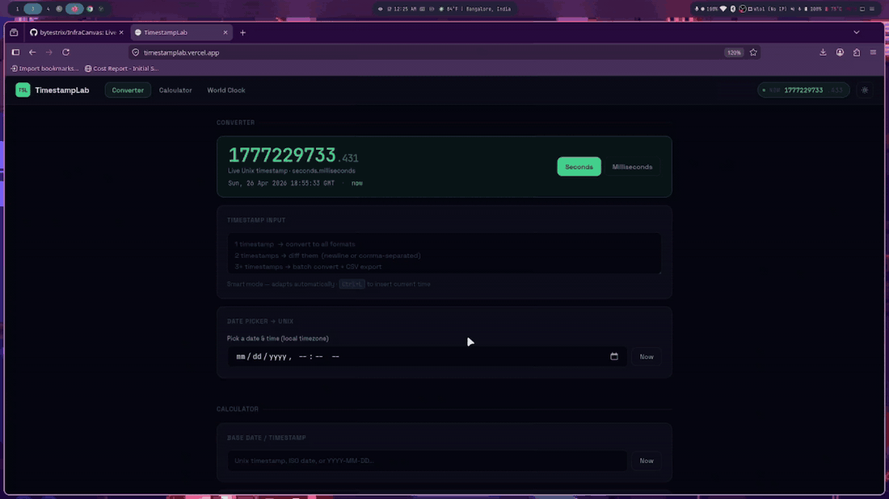

# TimestampLab

Lightweight timestamp utilities with automatic seconds/milliseconds detection. Zero dependencies, ~3KB gzipped.



```bash
npm install timestamplab-core
```

## Why TimestampLab?

**The timestamp-focused library that just works.**

- 🎯 **Auto-detects** seconds vs milliseconds - no need to specify
- 🪶 **Tiny** - only ~3KB gzipped (smaller than dayjs!)
- 📦 **Zero dependencies**
- 🔧 **Full TypeScript support**
- ⚡ **Fast** - optimized for performance
- 🌐 **Works everywhere** - Node, Browser, Edge

## The Problem

```javascript
// With other libraries, YOU must specify:
dayjs.unix(1777187459)        // Must know it's seconds
dayjs(1777187459000)          // Must know it's milliseconds
// ❌ You need to know which one it is!
```

## The Solution

```javascript
import { toMs } from 'timestamplab-core';

// TimestampLab auto-detects:
toMs(1777187459);      // ✅ Auto-detects seconds → 1777187459000
toMs(1777187459000);   // ✅ Auto-detects milliseconds → 1777187459000
toMs('2024-01-01');    // ✅ Auto-detects ISO date → 1704067200000
```

## Quick Start

```typescript
import { toMs, fmtAll, diffTimestamps } from 'timestamplab-core';

// Auto-detect and convert
const ms = toMs(1777187459);  // No need to specify unit!

// Format to all formats at once
const formatted = fmtAll(1777187459);
console.log(formatted.iso);       // 2026-04-26T07:21:15.000Z
console.log(formatted.relative);  // 2 hours ago
console.log(formatted.local);     // April 26, 2026 at 12:51:15 PM

// Calculate difference
const diff = diffTimestamps(1777187459, 1777273859);
console.log(diff.days);  // 1
```

## Installation

```bash
# Core utilities
npm install timestamplab-core

# CLI tools
npm install -g timestamplab-cli

# Interactive world map (React)
npm install timestamplab-map
```

## API

### Detection

```typescript
import { detectUnit, detectAndNormalise, isValidTimestamp } from 'timestamplab-core';

detectUnit(1777187459);      // 's'
detectUnit(1777187459000);   // 'ms'

detectAndNormalise(1777187459);
// { unit: 's', epochMs: 1777187459000, epochS: 1777187459 }

isValidTimestamp(1777187459);  // true
```

### Conversion

```typescript
import { toMs, toSeconds } from 'timestamplab-core';

toMs(1777187459);              // 1777187459000 (auto-detected)
toMs(1777187459.664);          // 1777187459664 (decimals supported)
toMs('2024-01-01');            // 1704067200000 (parsed ISO)
toMs(new Date());              // current timestamp

toSeconds(1777187459000);      // 1777187459
```

### Formatting

```typescript
import { fmtAll, relTime, toISO } from 'timestamplab-core';

fmtAll(1777187459);
// {
//   iso: '2026-04-26T07:21:15.000Z',
//   utc: 'Sun, 26 Apr 2026 07:21:15 GMT',
//   local: 'April 26, 2026 at 12:51:15 PM',
//   relative: '2 hours ago',
//   unix_s: '1777187459',
//   unix_ms: '1777187459000'
// }

relTime(Date.now() - 3600000);  // "1 hour ago"
relTime(Date.now() + 86400000); // "in 1 day"
toISO(1777187459);              // "2026-04-26T07:21:15.000Z"
```

### Difference

```typescript
import { diffTimestamps, formatDiff } from 'timestamplab-core';

const diff = diffTimestamps(1777187459, 1777273859);
// {
//   days: 1, hours: 0, minutes: 0, seconds: 0,
//   totalDays: 1, totalHours: 24, totalMinutes: 1440, ...
// }

formatDiff(diff);  // "1d 0h 0m 0s"
```

### Batch Processing

```typescript
import { batchProcess, exportToCSV } from 'timestamplab-core';

const results = batchProcess(['1777187459', '1777273859', 'invalid']);
// [
//   { input: '1777187459', success: true, timestamp: {...}, formatted: {...} },
//   { input: '1777273859', success: true, timestamp: {...}, formatted: {...} },
//   { input: 'invalid', success: false, error: 'Invalid timestamp' }
// ]

const csv = exportToCSV(results);  // Export to CSV string
```

## Interactive Map

```bash
npm install timestamplab-map
```

```tsx
import { WorldMap } from 'timestamplab-map';

function App() {
  return (
    <WorldMap
      onCityClick={(city) => console.log(city.name, city.tz)}
      onCountryClick={(country, cities) => console.log(country.name, cities)}
      selectedTz="Asia/Kolkata"
      userCountry="India"
    />
  );
}
```

Features: 175 countries, 80+ city dots, hover tooltips with live time, click to select, zero dependencies, pure SVG.

## CLI

```bash
npm install -g timestamplab-cli
```

```bash
# Convert timestamp
tsl convert 1777187459

# Get current time
tsl now

# Calculate difference
tsl diff 1777187459 1777273859

# Batch convert
tsl batch timestamps.txt --csv output.csv

# Time calculator
tsl calc 1777187459 +1d      # Add 1 day
tsl calc 1777187459 -2h30m   # Subtract 2 hours 30 minutes
```

## TypeScript

Full TypeScript support with complete type definitions:

```typescript
import type { 
  TimestampUnit, 
  TimestampInput, 
  TimestampInfo,
  FormattedTimestamp,
  TimestampDiff,
  BatchResult 
} from 'timestamplab-core';

type TimestampUnit = 's' | 'ms';
type TimestampInput = string | number | Date;

interface FormattedTimestamp {
  iso: string;
  utc: string;
  local: string;
  relative: string;
  unix_s: string;
  unix_ms: string;
}
```

## Comparison

| Feature | TimestampLab | date-fns | dayjs | luxon |
|---------|--------------|----------|-------|-------|
| Auto-detect | ✅ | ❌ | ❌ | ❌ |
| Bundle Size | ~3KB | ~13KB | ~7KB | ~72KB |
| Dependencies | 0 | 0 | 0 | 0 |
| TypeScript | ✅ Native | ✅ | ✅ | ✅ |
| Learning Curve | Low | High | Low | Medium |
| Timestamp Focus | ✅ | ❌ | ❌ | ❌ |

## Use Cases

- **Log Analysis** - Convert timestamps from various sources
- **API Integration** - Handle different timestamp formats automatically
- **Analytics Dashboards** - Display time-series data
- **Chat Applications** - Show relative timestamps ("2 hours ago")
- **Admin Panels** - User activity timestamps
- **DevOps Tools** - Log monitoring and analysis

## Development

```bash
# Install dependencies
npm install

# Build all packages
npm run build

# Run tests
npm run test
```

## Packages

- **timestamplab-core** - Core utilities
- **timestamplab-cli** - Command-line tools
- **timestamplab-map** - Interactive world map React component

## License

MIT © TimestampLab

## Links

- [npm - Core](https://www.npmjs.com/package/timestamplab-core)
- [npm - CLI](https://www.npmjs.com/package/timestamplab-cli)
- [Web App](https://timestamplab.dev)
